# WeRevo

Visit the deployed site: [WeRevo](https://shaAnder.github.io/weRevo/)

A mindful app for mindful people

Mental and physical health should be at the forefront of everyones minds, but having the ability to just practice it on the go and easily seems to elude us sometimes, this app aims to solve that bu adding a central place to view and practice various meditation / yoga / mindfulness techniques

[Apa](https://www.apa.org/monitor/2012/07-08/ce-corner#:~:text=Researchers%20theorize%20that%20mindfulness%20meditation,to%20effective%20emotion-regulation%20strategies.) shows that there are a host of benefits to working on your mindfulness and meditation.

There is never a bad time to practice bettering your mental and physical health. It's proven to always be beneficial to the body, improve focus and help people become more resiliant, and as a practioner of some of the techniques listed, i can attest to their value.

## CONTENTS

- [User Experience](#user-experience-ux)

  - [User Stories](#user-stories)

- [Design](#design)

  - [Colour Scheme](#colour-scheme)
  - [Typography](#typography)
  - [Imagery](#imagery)
  - [Wireframes](#wireframes)
  - [Features](#features)
    - [The Home Page](#the-home-page)
    - [The Signup Page](#the-signup-page)
    - [The Activities Page](#the-activities-page)
    - [The Discipline Chosen Page](#the-discipline-chosen-page)
    - [The Activity Chosen Page](#the-activity-chosen-page)
    - [Future Implementations](#future-implementations)
  - [Accessibility](#accessibility)

- [Technologies Used](#technologies-used)

  - [Languages Used](#languages-used)
  - [Frameworks, Libraries & Programs Used](#frameworks-libraries--programs-used)

- [Deployment & Local Development](#deployment--local-development)

  - [Deployment](#deployment)
  - [Local Development](#local-development)
    - [How to Fork](#how-to-fork)
    - [How to Clone](#how-to-clone)

- [Testing](#testing)
  - [Solved Bugs](#solved-bugs)
  - [Known Bugs](#known-bugs)
- [Credits](#credits)
  - [Code Used](#code-used)
  - [Content](#content)
  - [Media](#media)
  - [Acknowledgments](#acknowledgments)

---

## User Experience (UX)

### User Stories

#### First Time Visitor Goals

- I want to have an app that can allow me to easily access information about meditation and yoga and in the future have tutorials on how to do these practices
- I have developed the site with responsiveness for web browsers, tablets and mobile in mind.
- I want the site to be easy to navigate.

#### Returning Visitor Goals

- I want to be able to sign up to the app for the app for future features and more

---

## Design

### Colour Scheme

For the colors I decided to opt for a colorset that is similar to lilac as that is a flower known for wellness and healing, as well as this it creates for a warmer more approachable design.

In my css file I have used variables to declare colours, and then used these throughout the css file. Variable are a fantastic way to enforce consistency and allow us to create more complex code that we don't need to alter at every turn.

From this color palette we used the following colors.

- I used `#2b1E25` as our darker background color for when we're overlaying white text or if we just need a darker tone in general

- I used `BF94BC` as our primary lighter color for when we want to do hovering on the navbar

- I then used `#603B61` and `#D2B0D0` as backup colors or for when i needed a shade lighter in certain areas

- I also used `#f5f5f5` & `#000000` as the primary and secondary colours used for the sites text. as these are the most common you will generally see in webdesign

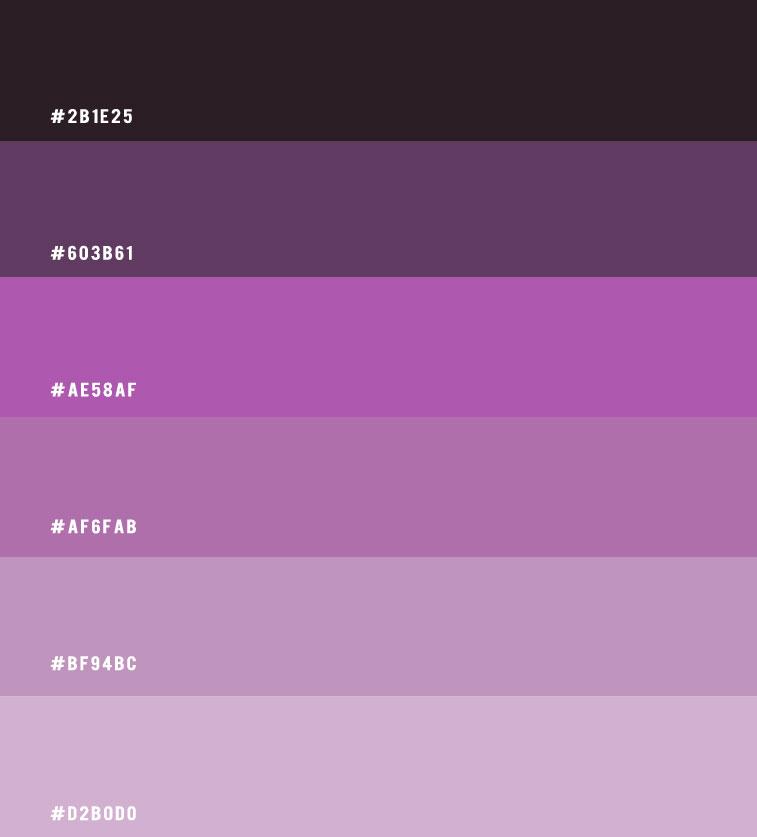

### Typography

For our typography I opted for two primary fonts, firstly I went with [Sen](https://fonts.google.com/specimen/Sen?query=sen#glyphs), this font is geometric and neutral font with a soft, humanist touch, it's easy to read and is practical. Similar to how we want to our application to look.

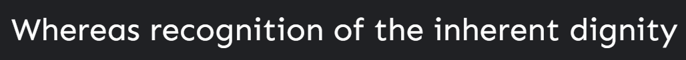

For a secondary font I opted for [Tenor](https://fonts.google.com/specimen/Tenor+sans) this is a tried and true font that works in every occasion, and again looks neat, sensible and is great for paragraphs and headings alike.

### Imagery

As the app is about mindfulness and meditation I have opted to fill it with imagery depicting such, for various banners and hero pages we can see people practicing meditation or yoga and as well as this each specific example of wellness showcases imagery representing it.

### Wireframes

Wireframes were created for mobile, tablet and desktop using balsamiq.

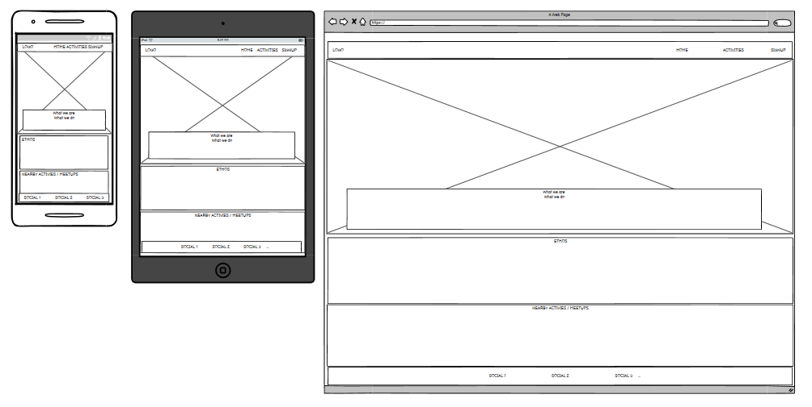
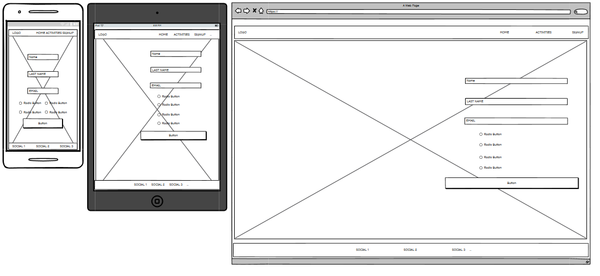
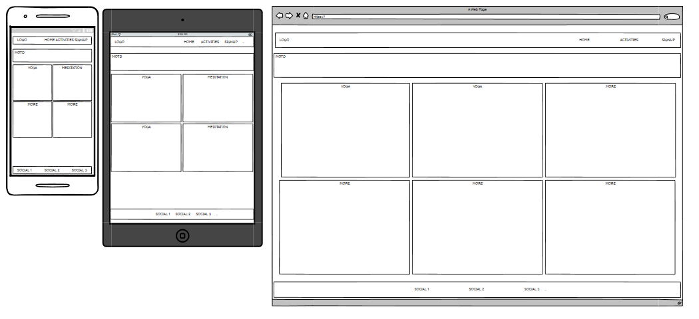

### Features

The website is comprised of a home page, an activities page, pages giving the user information about the activities of yoga and meditation as well as a signup page for future features.

All Pages on the website are responsive and have:

* A favicon in the browser tab.

  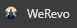

* The title of the site at the top of every page. This title also acts as a link back to the home page.
  

#### The Home Page

The home page of WeRevo is a simple yet elegant page mirroring the themes and imagery of wellness, I took inspiration from the love running project for the landing page as it fits the idea of simplistic and beautiful. While also being detailed yet to the point. Allowing the user to scroll 

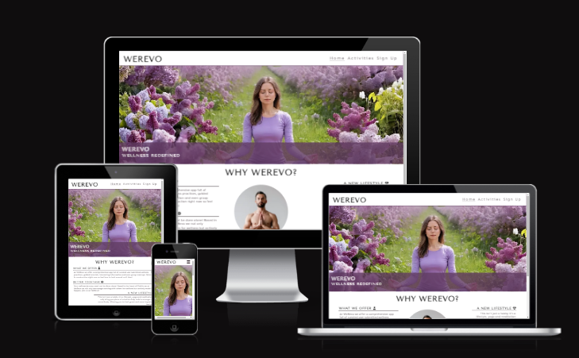

This page includes some information about the company and what we do / why wellness is so important.

#### The Activities Page

The game page displays the main page of the app, an activities page, it allows the user to view the MOTD (message of the day), which is an inspirational quote followed by being able to click on the yoga or meditation sections. 

Clicking either of these sections will lead the user to the relevant page, which at the moment only contains some fun facts about yoga and meditation but in the future aims to cover guides and tutorials on how to do the activities correctly

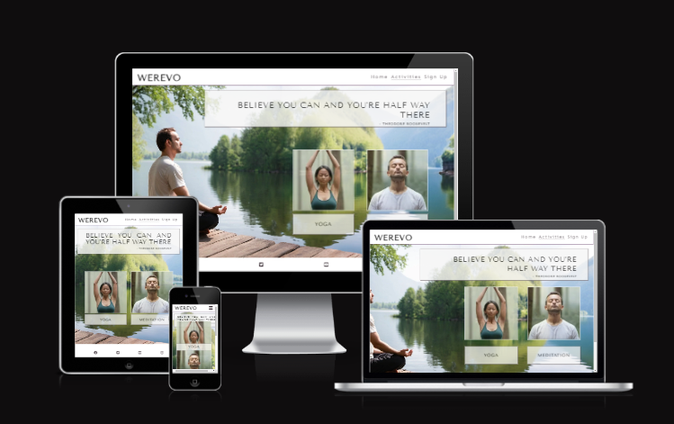

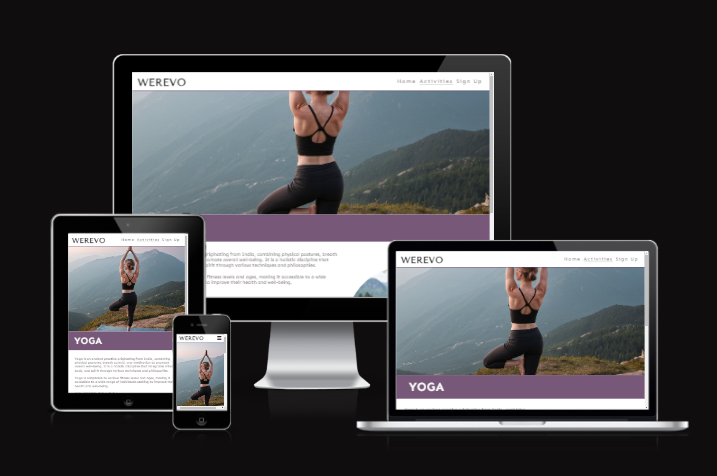

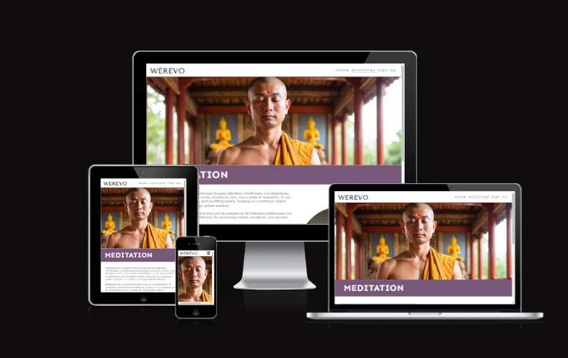

#### The Signup Page

Finally we have the signup page, this is a page that for now links to code institutes form dump, but as a planned feature will allow a user to signup to the website, to allow them to save their favourites, submit new ideas and get wellness tips sent to them via a newsletter.

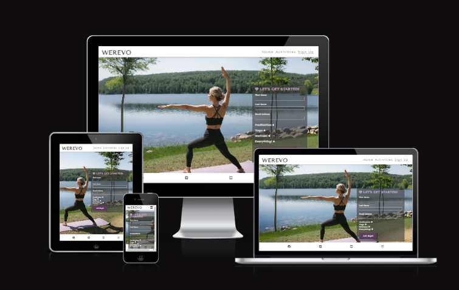

#### Future Implementations

As this app is merely a static component showcasing some tips ect for now, i have a lot id like to do with it in the future, first and foremost id like to rebuild it using django templating to allow for cleaner and easier loading.

Other implementations I want to consider are:

1. Building a database to store logins, and creating a working login system
2. Adding yoga and meditation practices and tutorials from a local api or db to populate
for the user to view and scroll.
3. Adding the ability for a user to add their own 
4. Adding a meetups feature so that users can organize their own wellness sessions

These are some of many ideas I have for this application

### Accessibility

While I think the website does have a good host of accessibility i do wish to add more options where avaible, such as a wider range of support for devices and ARIA features.
- - -

## Technologies Used

### Languages Used

HTML, CSS

### Frameworks, Libraries & Programs Used

* [Balsamiq](https://balsamiq.com/) - Used to create wireframes.

* [Git](https://git-scm.com/) - For version control.

* [Github](https://github.com/) - To save and store the files for the website.

* [GitPod](https://gitpod.io/) - IDE used to create the site.

* [Google Fonts](https://fonts.google.com/) - To import the fonts used on the website.

* [Google Developer Tools](https://developers.google.com/web/tools) - To troubleshoot and test features

* [Favicon.io](https://favicon.io/) To create favicon.

* [Am I Responsive?](http://ami.responsivedesign.is/) To show the website image on a range of devices.

* [Shields.io](https://shields.io/) To add badges to the README

* [Lighthouse](https://chrome.google.com/webstore/detail/lighthouse/blipmdconlkpinefehnmjammfjpmpbjk?pli=1) - a chrome extension to rate the site based on performance, accessibility, seo and Best practices

* [Web Disability Simulator](https://chrome.google.com/webstore/detail/web-disability-simulator/olioanlbgbpmdlgjnnampnnlohigkjla) - a google chrome extension that allows you to view your site as people with accessibility needs would see it.

* [Webpage Spell-Check](https://chrome.google.com/webstore/detail/webpage-spell-check/mgdhaoimpabdhmacaclbbjddhngchjik/related) - a google chrome extension that allows you to spell check your webpage. Used to check the site and the readme for spelling errors.

- - -

## Deployment & Local Development

### Deployment

The site is deployed using GitHub Pages - [WeRevo](https://shaAnder.github.io/werevo/).

To Deploy the site using GitHub Pages:

1. Login (or signup) to Github.
2. Go to the repository for this project, [shaAnder/werevo](https://github.com/shaAnder/werevo).
3. Click the settings button.
4. Select pages in the left hand navigation menu.
5. From the source dropdown select main branch and press save.

### Local Development

#### How to Fork

To fork the repository:

1. Log in (or sign up) to Github.
2. Go to the repository for this project, [shaAnder/werevo](https://github.com/shaAnder/werevo)
3. Click the Fork button in the top right corner.

#### How to Clone

To clone the repository:

1. Log in (or sign up) to GitHub.
2. Go to the repository for this project, [shaAnder/werevo](https://github.com/shaAnder/werevo)
3. Click on the code button, select whether you would like to clone with HTTPS, SSH or GitHub CLI and copy the link shown.
4. Open the terminal in your code editor and change the current working directory to the location you want to use for the cloned directory.
5. Type 'git clone' into the terminal and then paste the link you copied in step 3. Press enter.

- - -

## Testing

Please refer to [TESTING.md](TESTING.md) file for all testing carried out.
