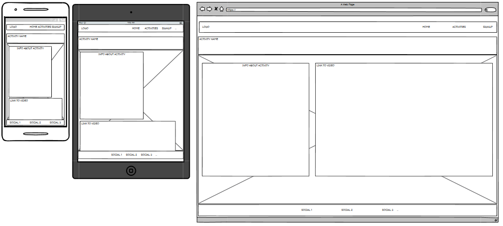

# WeRevo

Visit the deployed site: [WeRevo](https://shaAnder.github.io/weRevo/)

A mindful app for mindful people

Mental and physical health should be at the forefront of everyones minds, but having the ability to just practice it on the go and easily seems to elude us sometimes, this app aims to solve that bu adding a central place to view and practice various meditation / yoga / mindfulness techniques

[Apa](https://www.apa.org/monitor/2012/07-08/ce-corner#:~:text=Researchers%20theorize%20that%20mindfulness%20meditation,to%20effective%20emotion-regulation%20strategies.) shows that there are a host of benefits to working on your mindfulness and meditation.

There is never a bad time to practice bettering your mental and physical health. It's proven to always be beneficial to the body, improve focus and help people become more resiliant, and as a practioner of some of the techniques listed, i can attest to their value.

## CONTENTS

- [User Experience](#user-experience-ux)

  - [User Stories](#user-stories)

- [Design](#design)

  - [Colour Scheme](#colour-scheme)
  - [Typography](#typography)
  - [Imagery](#imagery)
  - [Wireframes](#wireframes)
  - [Features](#features)
    - [The Home Page](#the-home-page)
    - [The Signup Page](#the-signup-page)
    - [The Activities Page](#the-activities-page)
    - [The Discipline Chosen Page](#the-discipline-chosen-page)
    - [The Activity Chosen Page](#the-activity-chosen-page)
    - [Future Implementations](#future-implementations)
  - [Accessibility](#accessibility)

- [Technologies Used](#technologies-used)

  - [Languages Used](#languages-used)
  - [Frameworks, Libraries & Programs Used](#frameworks-libraries--programs-used)

- [Deployment & Local Development](#deployment--local-development)

  - [Deployment](#deployment)
  - [Local Development](#local-development)
    - [How to Fork](#how-to-fork)
    - [How to Clone](#how-to-clone)

- [Testing](#testing)
  - [Solved Bugs](#solved-bugs)
  - [Known Bugs](#known-bugs)
- [Credits](#credits)
  - [Code Used](#code-used)
  - [Content](#content)
  - [Media](#media)
  - [Acknowledgments](#acknowledgments)

---

## User Experience (UX)

### User Stories

#### First Time Visitor Goals

- I want to have an app that can allow me to easily access information and tutorials on how to do various mindful practices such as meditation and yoga
- I have developed the site with responsiveness for web browsers, tablets and mobile in mind.
- I want the site to be easy to navigate.

#### Returning Visitor Goals

- I want to be able to pick from multiple different meditaiton and yoga types as well as have the ability to navigate to more
- I want to be able to sign up to the app for the app for future features and more
- I want to be able to suggest my own ideas for future updates

---

## Design

### Colour Scheme

For the colors I decided to opt for a colorset that is similar to lilac as that is a flower known for wellness and healing, as well as this it creates for a warmer more approachable design.

In my css file I have used variables to declare colours, and then used these throughout the css file. Variable are a fantastic way to enforce consistency and allow us to create more complex code that we don't need to alter at every turn.

From this color palette we used the following colors.

- I used `#2b1E25` as our darker background color for when we're overlaying white text or if we just need a darker tone in general

- I used `BF94BC` as our primary lighter color for when we want to do hovering on the navbar

- I then used `#603B61` and `#D2B0D0` as backup colors or for when i needed a shade lighter in certain areas

- I also used `#f5f5f5` & `#000000` as the primary and secondary colours used for the sites text. as these are the most common you will generally see in webdesign

### Typography

For our typography I opted for two primary fonts, firstly I went with [Sen](https://fonts.google.com/specimen/Sen?query=sen#glyphs), this font is geometric and neutral font with a soft, humanist touch, it's easy to read and is practical. Similar to how we want to our application to look.

For a secondary font I opted for [Oswald](https://fonts.google.com/specimen/Oswald) this is a tried and true font that works in every occasion, and again looks neat, sensible and is great for paragraphs and headings alike.

### Imagery

As the app is abut mindfulness and meditation I have opted to fill it with imagery depicting such, for various banners and hero pages we can see people practicing meditation or yoga and as well as this each specific example of wellness showcases imagery representing it.

### Wireframes

Wireframes were created for mobile, tablet and desktop using balsamiq.

