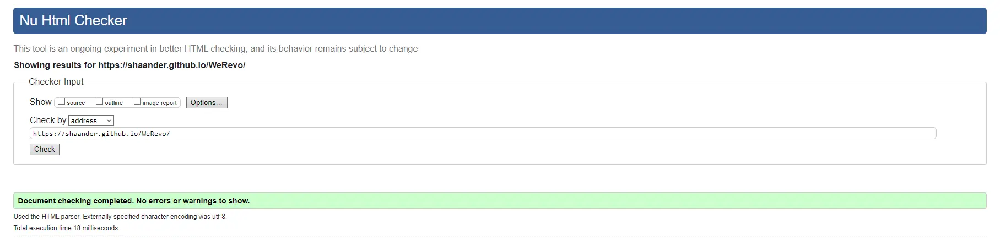
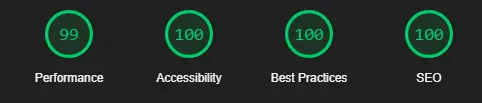
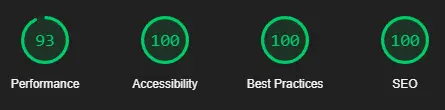

# WeRevo - Testing

(variety image here)

Visit the deployed site: [We Revo](https://shaAnder.github.io/weRevo)

---

## CONTENTS

- [AUTOMATED TESTING](#automated-testing)
  - [W3C Validator](#w3c-validator)
  - [JavaScript Validator](#javascript-validator)
  - [Lighthouse](#lighthouse)
- [MANUAL TESTING](#manual-testing)
  - [Testing User Stories](#testing-user-stories)
  - [Full Testing](#full-testing)

Throughout the entire build testing was on going, each new feature was rigorously tested to make sure it was working when used.

To aid in development google dev tools, as well as lighthouse, the w3 validators, spellcheck and disabiliy view plugins were utilized were utilized to ensure everything worked to standard

I also went through each page and tested the features vs my established user stories to ensure it was all working correctly

---

## AUTOMATED TESTING

### W3C Validator

[W3C](https://validator.w3.org/) was used to validate the html and css to check for errors and consistency

Index - Passed.
 
Activities - Passed.
 
Yoga - Passed.
 
Meditation - Passed.
 
Signup - Passed.
 
Confirm - Passed.
 
Style.css - Passed.
 

---

### Lighthouse

I also used the lighthouse chrome plugin to run checks for each page on both desktop and mobile view. I focued my efforts on attaining a high level of accessibility, best practices and seo, performance was attained where it was able but seeing as we were not tought about website optimization yet it wasn't high on my list of priorities.

### Desktop Results

The desktop results all performed similarly and as expected, barring small fluctuations in performance they all looked like the following:

### Mobile Results

The mobile results were more of the same the performance was a bit lower due to the sizing of the images, however adding preloaded images in seemed to fix this.

---

## MANUAL TESTING

### Testing User Stories

`First Time Visitors`

| Goals                                                                                                                                                 | How are they achieved?                                                                                                                                                                                                                             |
| :---------------------------------------------------------------------------------------------------------------------------------------------------- | :------------------------------------------------------------------------------------------------------------------------------------------------------------------------------------------------------------------------------------------------- |
| I want to have an app that can allow me to easily access information and tutorials on how to do various mindful practices such as meditation and yoga | The site is designed with yoga / meditation and fitness in mind, utilizing a varitety of warm colors / colors associated with healing, featuring quick and easy navigation to various sections that showcase various meditation and yoga practices |
| I want the site to be responsive.                                                                                                                     | I have developed the site with responsiveness for web browsers, tablets and mobile in mind                                                                                                                                                         |
| I want the site to be easy to navigate.                                                                                                               | The site is built with a responsiveness and easy navigation in mind with a varity of buttons that clearly mark where they will take the user as well as quick nav links on every page to allow the user to move around the various pages easily    |

`Returning Visitors`

| Goals                                                                                                                       | How are they achieved?                                                                                                                                                   |
| :-------------------------------------------------------------------------------------------------------------------------- | :----------------------------------------------------------------------------------------------------------------------------------------------------------------------- |
| I want to be able to pick from multiple different meditaiton and yoga types as well as have the ability to navigate to more | Users are able to choose between what discipline they want to practice as well as what specific type they would like to try eg. meditation -> Trataka or Yoga -> Vinyasa |
| I want to be able to sign up to the app for the app for future features and more                                            | Users of the site are able to sign up to the application, for project purposes this leads to the code institute form dump and does not save inputted data                |
| I want to be able to suggest my own ideas for future updates                                                                | Users can suggest their own features for meditation / yoga, for project purposes this leads to the code institute form dump and does not save inputted data              |

---

### Full Testing
Full testing was performed with google chrome as a baseline, i thenutilized the responsive design features to test on a variety of screen sizes

Screen sizes tested:

Mobile Phone:
  - Samsung S8+

Tablet Size:
  - I pad mini

Laptop / Desktop / Browser:
  - Google chrome
  - Opera Gx
  - Firefox

Additionally I tested this using both of my mobile phones and no issue was found:
- Galaxy A33 5g
- Samsung S5

As well as this testing was taken by friends and family and any issues found were minor and could not be replicated within reasonable testing

Finally I tested each feature implemented and got the following results

| Feature         | Expected Outcome                            | Testing Performed | Result                     | Pass/Fail |
| --------------- | ------------------------------------------- | ----------------- | -------------------------- | --------- |
| The Sites title | Link directs the user back to the home page | Clicked title     | Directed back to home page | Pass      |
| The Nav Bar     | Links to various pages worked               | Clicked Links     | Directed to various pages  | Pass      |
| All buttons - hover effect | All buttons changed color when hovered | Hovered over buttons on page | Each button displayed correct styling | Pass |
| Interactive Elements | All Interactive elements changed color when hovered | hovered over elements and links | Links changed color / moved | Pass |
| Index Page Sign up | Links user to sign up page | clicked button | User directed to signup page | Pass |
| Rest of navigation links | Links to various pages all work correctly | Clicked through every link on a variety of devices | Links worked as expected | Pass |
| Sign up to confirmation | User signs up and gets confirmation they signed up | Filled in user data and submitted | Was sent to confirm page | Pass |
| Buttons to go back to home | Added a button to return home on the confirm page designed to take user home | Clicked button | Sent to home | Pass |   

### Known Bugs 

Currently there is one known bug, on various preview windows, the zoom on the page is enhanced killing functionality of the app, upon swapping back to a different device layout it returns to normal,
this is a bug that has only been observed on firefox and is intermittent, I have not been able to replicate the bug on any of my physical devices or on google chrome / opera gx. Nor does the bug appear on deployed pages. I am currently looking into a fix however i suspect this is an issue with the firefox dev tools. 